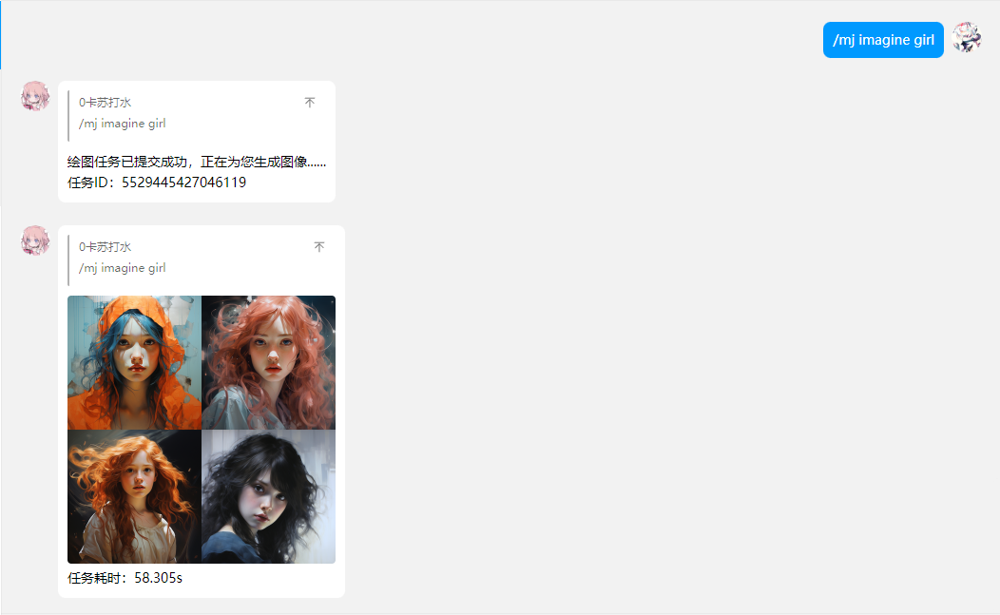
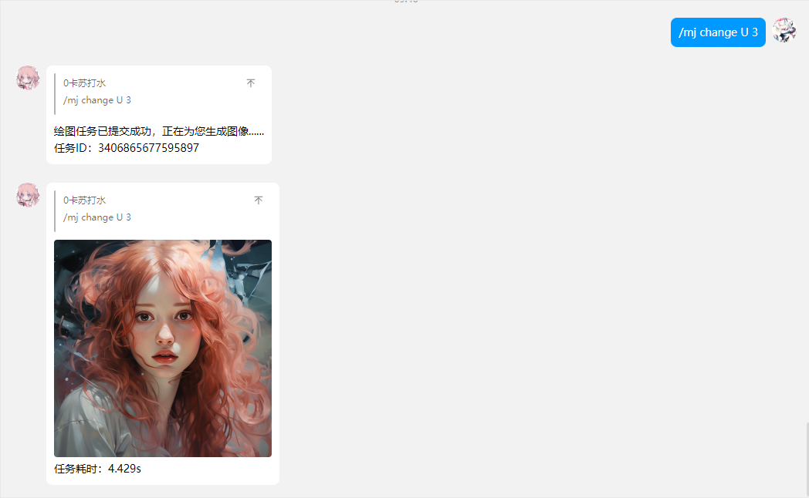
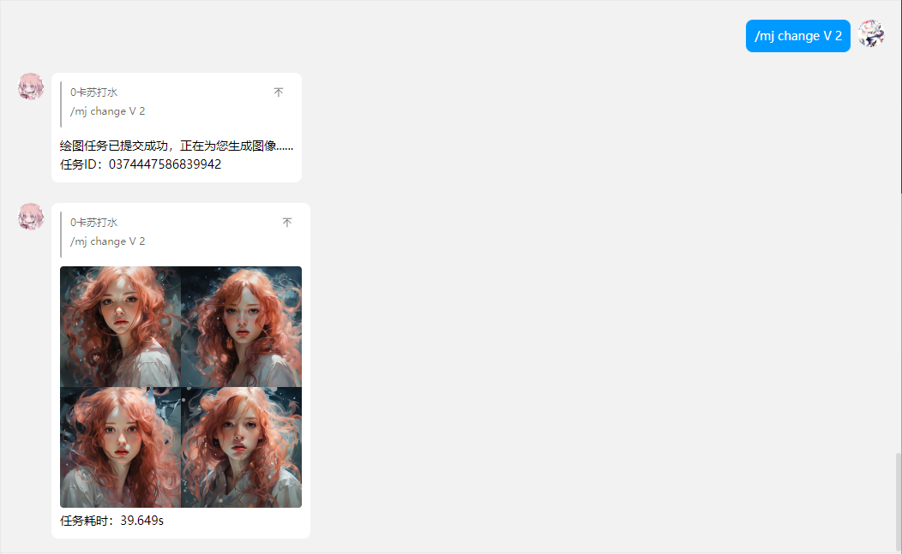
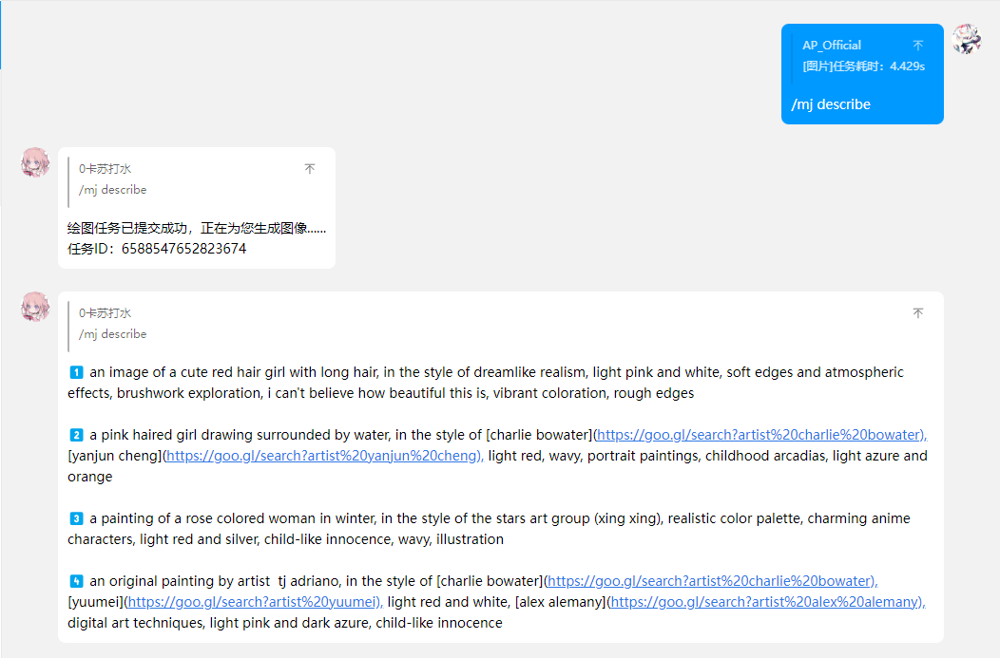

<p align="center">
  <a href="https://ap-plugin.com/"></a>
</p>

<div align="center">

# MJ-PLUGIN

_🎉 基于 Yunzai-Bot 的 AI 绘图插件 🎉_

</div>

<p align="center">
  </a>
    
  </a>
</p>

---

<span id="header"></span>

<p align="center">
  
  
  <br>
  </a>
    
  </a>
    <a href="https://jq.qq.com/?_wv=1027&k=OtkECVdE">
    
  </a>
    <a href="https://jq.qq.com/?_wv=1027&k=FZUabhdf">
    
  </a>
</p>

<p align="center">
  <a href="https://gitee.com/CikeyQi/mj-plugin">项目地址</a>
  ·
  <a href="#安装插件">开始使用</a>
  ·
  <a href="#配置接口">配置接口</a>
</p>

## 简介

MJ-Plugin 是一款在 QQ 内快速调用[Midjourney](https://www.midjourney.com/)进行多参数便捷 AI 绘图的[Yunzai-Bot](https://github.com/Le-niao/Yunzai-Bot)插件，本插件功能不断拓展中，更多功能敬请期待……

<br>

## 安装插件

#### 1. 挂载至 Yunzai-Bot 目录

```
cd Yunzai-Bot
```

#### 2. 克隆本仓库至 plugins 目录

- 使用 Gitee（国内服务器推荐使用此方法）

```
git clone https://gitee.com/CikeyQi/mj-plugin.git ./plugins/mj-plugin
```

- 使用 Github

```
git clone https://github.com/ap-plugin/mj-plugin.git ./plugins/mj-plugin
```

#### 3. 重启 Yunzai

```
pnpm restart
```

<br><br>

## 配置接口

[点击配置midjourney-proxy](https://github.com/novicezk/midjourney-proxy/blob/main/docs/zeabur-start.md)

配置好API服务端后，对机器人使用命令 `/mj setting midjourney_proxy_api 你的API的Host`

示例：`/mj setting midjourney_proxy_api https://midjourney-proxy.zeabur.app`

**如果你是公域机器人**：`/mj setting shield true` 即可屏蔽艾特

<br><br>

## 功能演示

### Midjourney Imgine 想象

指令：`/mj imagine [prompt]` 可带图

<p>
  </a>
    
  </a>
</p>

### Midjourney Upscale 放大

指令：`/mj change U [图片序号1-4]`

<p>
  </a>
    
  </a>
</p>

### Midjourney Variation 变幻

指令：`/mj change V [图片序号1-4]`

<p>
  </a>
    
  </a>
</p>

### Midjourney Describe 识图

指令：`/mj describe` 带上图

<p>
  </a>
    
  </a>
</p>

<br><br>

## Todo

- [ ] 支持更多的参数，如图片比例
- [ ] 增加预设功能
- [ ] 增加百度审核功能
- [ ] 支持API鉴权
- [ ] 增加分群策略

## 致谢

[Midjourney-proxy](https://github.com/novicezk/midjourney-proxy)：代理 MidJourney 的discord频道，实现api形式调用AI绘图

## 声明

此项目仅用于学习交流，请勿用于非法用途

### 爱发电

如果你喜欢这个项目，请不妨点个 Star🌟，这是对开发者最大的动力  
当然，你可以对我爱发电赞助，呜咪~❤️

<details>
<summary>展开/收起</summary>

<p>
  </a>
    
  </a>
</p>

</details>

## 我们

<a href="https://github.com/ap-plugin/mj-plugin/graphs/contributors">
  
</a>
