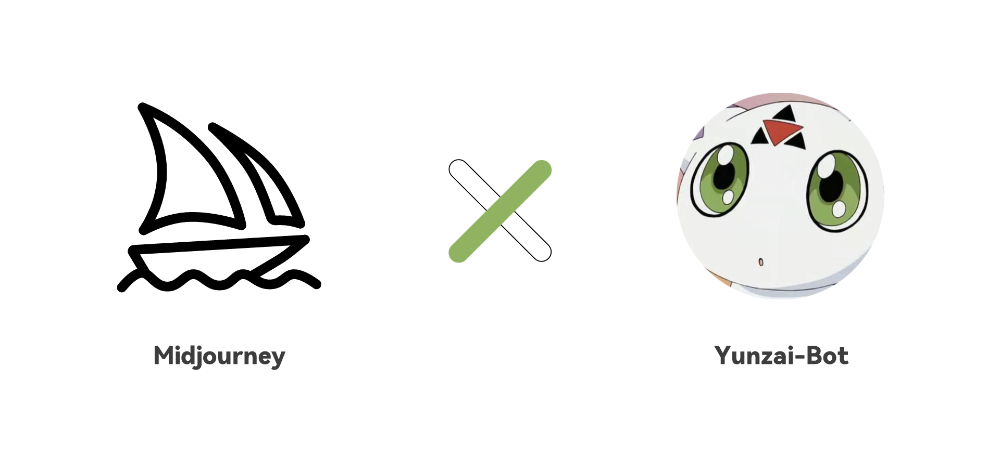

<p align="center">
  <a href="https://ap-plugin.com/"></a>
</p>

<div align="center">

# MJ-PLUGIN

_🎉 基于 Yunzai-Bot 的 AI 绘图插件 🎉_

</div>

<span id="header"></span>

<p align="center">
  
  
  <br>
  </a>
    
  </a>
    <a href="https://jq.qq.com/?_wv=1027&k=OtkECVdE">
    
  </a>
    <a href="https://jq.qq.com/?_wv=1027&k=FZUabhdf">
    
  </a>
</p>

<p align="center">
  <a href="https://gitee.com/CikeyQi/mj-plugin">项目地址</a>
  ·
  <a href="#安装插件">开始使用</a>
  ·
  <a href="#配置参数">配置参数</a>
</p>

## 简介

MJ-Plugin 是一款在 QQ 内快速调用[Midjourney](https://www.midjourney.com/)进行多参数便捷 AI 绘图的[Yunzai-Bot](https://github.com/Le-niao/Yunzai-Bot)插件，已兼容 Midjourney 大部分操作，在不同的地方体验 Discord 中的 Midjourney 带来的无限想象

<br>

## 安装插件

#### 1. 挂载至 Yunzai-Bot 目录

```
cd Yunzai-Bot
```

#### 2. 克隆本仓库至 plugins 目录

- 使用 Ghproxy（国内服务器推荐使用此方法）

```
git clone https://ghproxy.com/https://gitee.com/CikeyQi/mj-plugin.git ./plugins/mj-plugin
```

- 使用 Github

```
git clone https://github.com/ap-plugin/mj-plugin.git ./plugins/mj-plugin
```

#### 3. 重启 Yunzai

```
pnpm restart
```

<br><br>

## 配置参数

### 获取 salai_token

[登录 Discord](https://discord.com/channels/@me) F12 或者 [Ctrl + Shift + I] 或者 [Command + Option + I] 打开开发者工具，然后在 Console 中输入以下代码：

```javascript
window.webpackChunkdiscord_app.push([
  [Math.random()],
  {},
  (req) => {
    for (const m of Object.keys(req.c)
      .map((x) => req.c[x].exports)
      .filter((x) => x)) {
      if (m.default && m.default.getToken !== undefined) {
        return copy(m.default.getToken());
      }
      if (m.getToken !== undefined) {
        return copy(m.getToken());
      }
    }
  },
]);
console.log("%cWorked!", "font-size: 50px");
console.log(`%您的Token在剪贴板了!`, "font-size: 16px");
```

也可以通过 查看 network [获取 discord token](https://www.androidauthority.com/get-discord-token-3149920/)

---

### 获取server_id和channel_id

[创建一个 Discord 服务器](https://discord.com/blog/starting-your-first-discord-server) 并邀请 [Midjourney Bot](https://docs.midjourney.com/docs/invite-the-bot)

```bash
# 在浏览器中复制你的服务器网址
# `https://discord.com/channels/$SERVER_ID/$CHANNEL_ID`
server_id: "your-server-id"
channel_id: "your-channel-id"
salai_token: "上面刚获取的的，在你剪切版里"
```

<br><br>

## 功能列表

- [x] Imagine 想象/绘制
- [x] Variation 变化
- [x] Upscale 放大
- [x] Reroll 重绘
- [x] Blend 融合
- [x] FaceSwap 换脸
- [x] Shorten 优化
- [x] Describe 描述
- [x] Vary 调整
- [x] Vary 调整
- [x] Zoomout 拓展
- [x] Pan 平移
- [x] Info 信息
- [x] Setting 设置

<br>

## 致谢

[midjourney-api](https://github.com/erictik/midjourney-api)：MidJourney client. Unofficial Node.js client

## 声明

此项目仅用于学习交流，请勿用于非法用途

### 爱发电

如果你喜欢这个项目，请不妨点个 Star🌟，这是对开发者最大的动力  
当然，你可以对我爱发电赞助，呜咪~❤️

<details>
<summary>展开/收起</summary>

<p>
  </a>
    
  </a>
</p>

</details>

## 我们

<a href="https://github.com/ap-plugin/mj-plugin/graphs/contributors">
  
</a>
